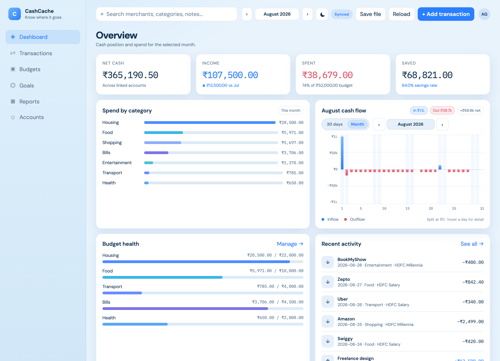
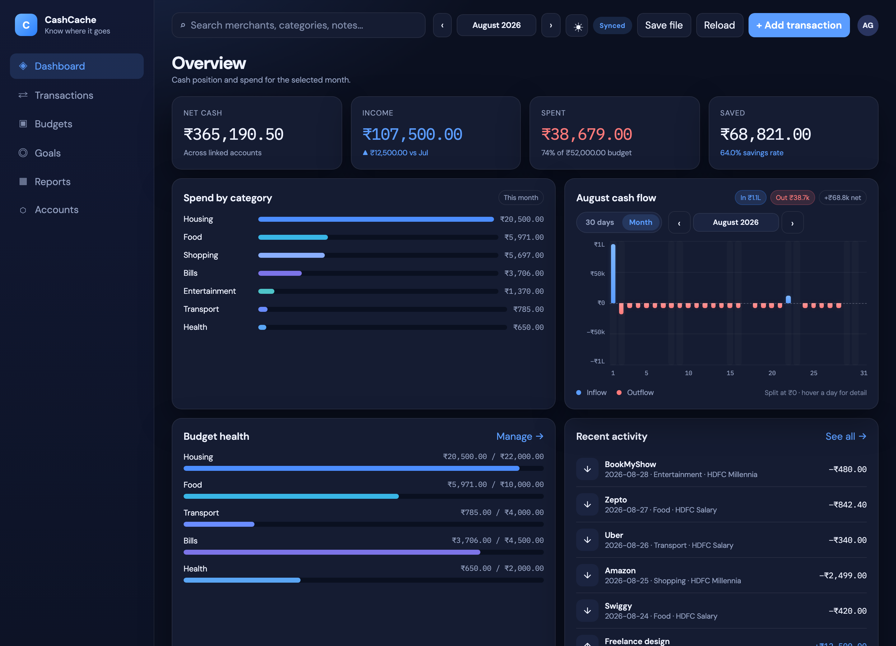
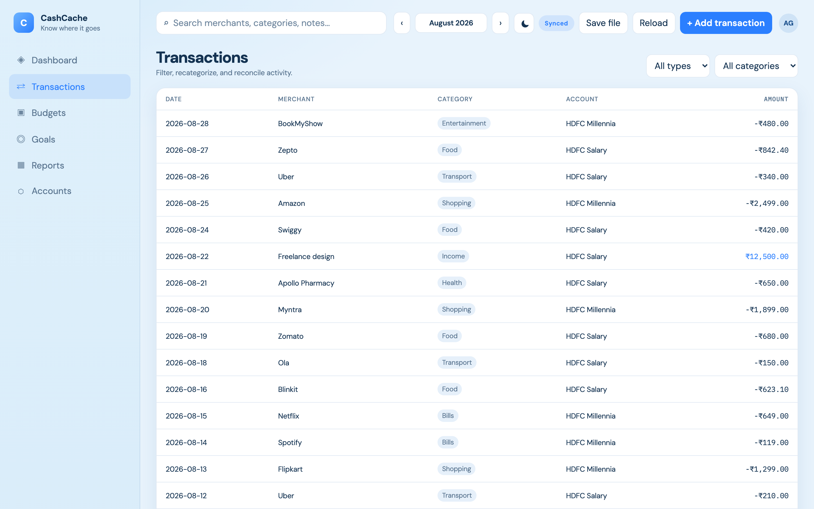
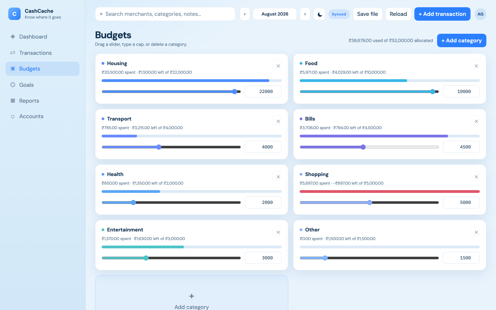
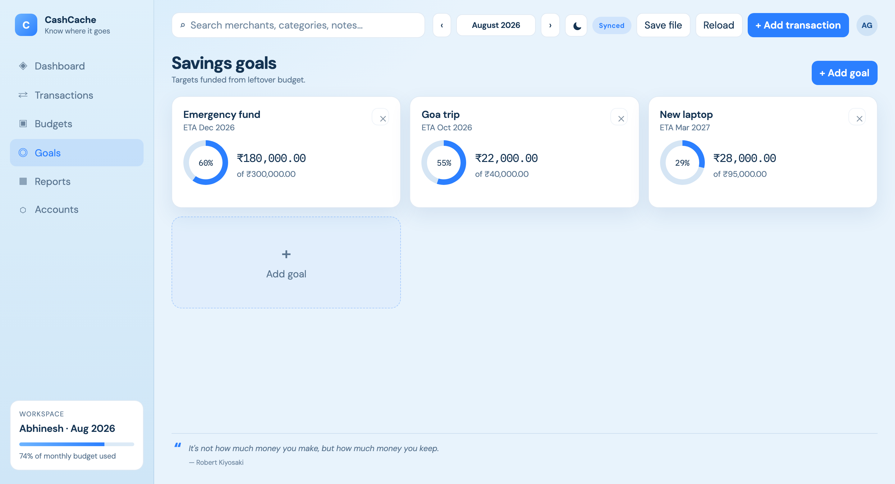
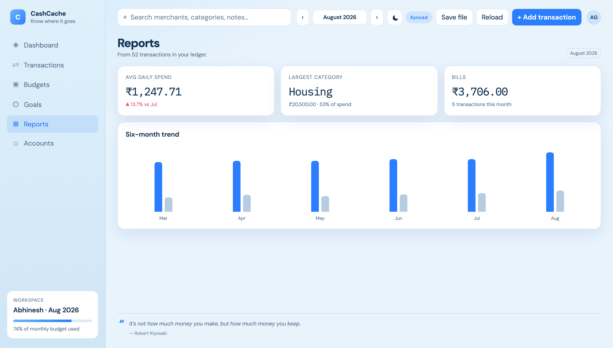
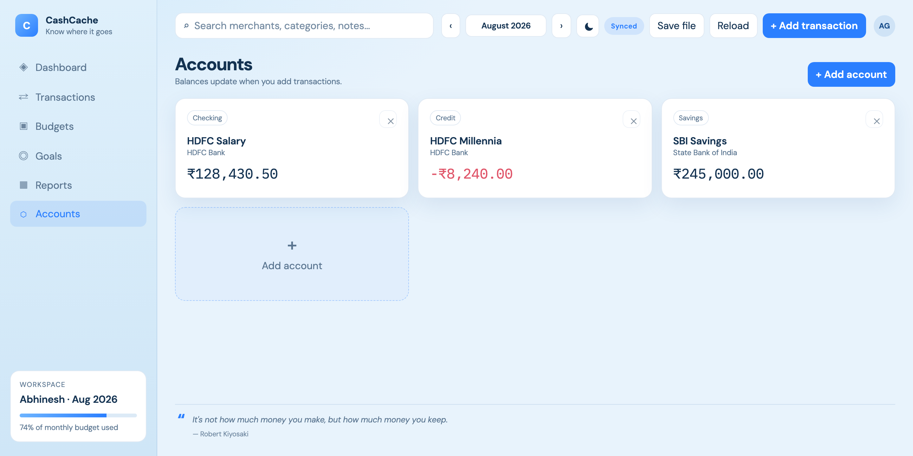
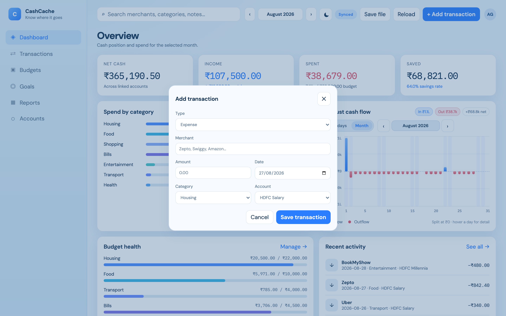
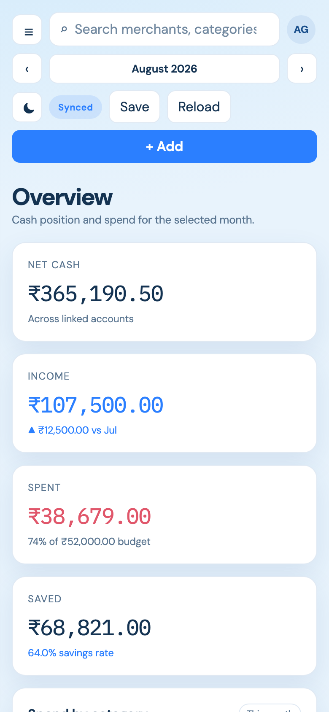

# CashCache

**Know where it goes.** A personal-finance workspace that runs entirely in the browser — no backend, no account, no trackers.

[](https://akgarhwal.github.io/CashCache/)



Track income and spend in ₹, set category budgets, watch daily cash flow, and keep savings goals in one place. Everything stays on your machine: `localStorage` in the browser, plus an optional JSON file you save and reload yourself.

Screenshots use the bundled sample ledger in [`examples/demo.json`](examples/demo.json).

## Features

- **Dashboard** — net cash, income, spend, savings rate, spend-by-category, and a 30-day or calendar-month cash-flow chart
- **Transactions** — search, filter by type/category, and a dated ledger table
- **Budgets** — per-category caps with sliders, typed amounts, and over-budget highlighting
- **Goals** — savings targets with progress rings
- **Reports** — average daily spend, top category, bills, and a six-month income vs spend trend
- **Accounts** — checking, savings, credit, and cash; balances update when you add activity
- **Smart merchants** — Zepto, Swiggy, Uber, Amazon, and similar names are categorized for you
- **Light / dark theme**
- **Save file / Reload** — backup and restore the whole workspace as JSON (File System Access API in Chromium, download fallback elsewhere)

## Screenshots

### Dark theme



### Transactions



### Budgets



### Savings goals



### Reports



### Accounts



### Add a transaction



### Phone layout



## Run locally

Open `index.html` in a browser, or serve the folder:

```bash
python3 -m http.server 8765
```

Then visit [http://localhost:8765](http://localhost:8765).

A local server is recommended if you want **Save file** to write back to the same JSON (Chromium). On `file://` the app still runs; save falls back to a download.

### Sample data

Use **Reload** and pick [`examples/demo.json`](examples/demo.json) to load the ledger shown in the screenshots.

## Data and privacy

- No server, no analytics, no cookies beyond what you type into the app
- Live state is stored in `localStorage` under `ledger.data.v3`
- **Save file** writes a JSON snapshot you can keep in Drive, a repo, or a USB stick
- Clearing site data wipes the in-browser copy — export first if you care about it

## Stack

Vanilla HTML, CSS, and JavaScript. No build step, no frameworks.

## License

[MIT](LICENSE) © 2026 Abhinesh
